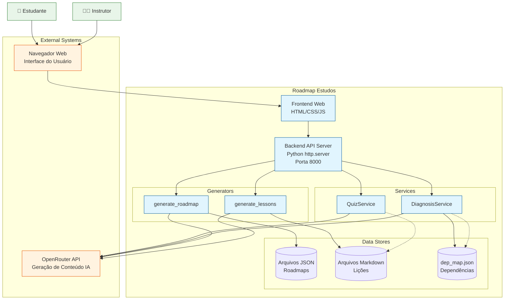
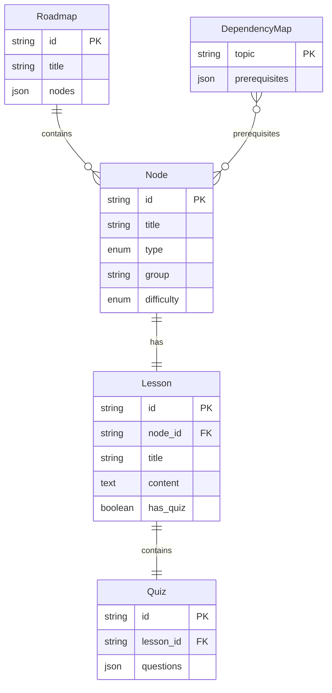

# Arquitetura do Sistema - Roadmap Estudos

## Visão Geral do Sistema

**Nome**: Roadmap Estudos  
**Tipo**: Aplicação Web Educacional  
**Tecnologia Principal**: Python 3.11+ com frontend HTML/CSS/JS vanilla  
**Propósito**: Plataforma para criação e visualização de roadmaps de estudos com geração assistida por IA

---

## Resumo Executivo

O Roadmap Estudos é uma aplicação educacional que permite aos usuários criar, visualizar e estudar roadmaps de conteúdo personalizado. O sistema utiliza integração com OpenRouter API para geração automática de lições, quizzes e diagnósticos de lacunas de conhecimento. A arquitetura é relativamente simples, organizada em camadas com separação clara entre handlers HTTP, serviços de negócio e utilitários de geração de conteúdo.

---

## C4 Nível 1 - Contexto do Sistema

### Diagrama de Contexto



### Personas e Interações

| Persona | Necessidade | Interação Principal |
|---------|-------------|---------------------|
| Estudante | Aprender tópicos estruturadamente | Visualiza roadmap, lê lições, resolve quizzes |
| Instrutor | Criar materiais didáticos | Solicita geração de roadmaps e lições via API |

---

## Estrutura de Entidades (ERD Resumido)

Para este sistema com menos de 5 entidades principais, o ERD está embutido:



---

## Tecnologias e Stack

| Camada | Tecnologia | Descrição |
|--------|------------|-----------|
| **Frontend** | HTML5, CSS3, JS (ES6+) | Interface web em `frontend/public/` |
| **Backend** | Python 3.11+, http.server | Servidor HTTP em `backend/` |
| **IA** | OpenRouter API | Geração de conteúdo educacional |
| **Persistência** | Sistema de Arquivos | JSON (`data/`) e Markdown (`licoes/`) |
| **Autenticação** | Bearer Token (env var) | OPENROUTER_API_KEY |

---

## Estrutura de Diretórios

```
roadmap-estudos/
├── backend/                    # Servidor Python
│   ├── api/
│   │   └── routes.py           # Endpoints REST
│   ├── core/
│   │   └── config.py            # Configurações
│   ├── services/
│   │   ├── ai_content/
│   │   │   ├── roadmap_generator.py
│   │   │   └── lesson_generator.py
│   │   ├── diagnosis/
│   │   │   └── diagnosis_service.py
│   │   ├── quiz/
│   │   │   └── quiz_service.py
│   │   └── dsl/
│   │       └── engine.py
│   └── main.py                 # Entry point
├── frontend/
│   └── public/
│       ├── index.html
│       └── assets/
│           ├── main.css
│           ├── app.js
│           ├── flowchart_layout.js
│           ├── flowchart_layout.css
│           └── roadmap_data.js
├── data/                       # Roadmaps JSON
├── licoes/                     # Lições Markdown
├── docs/                       # Documentação
├── scripts/                    # Utilitários
├── tests/                      # Testes pytest
├── harness.py                  # Orquestrador de validação
└── AGENTS.md                   # Instruções para agentes
```

---

## Fluxos Principais

### 1. Fluxo de Geração de Roadmap

```
Usuário → POST /api/generate-roadmap
        → routes.py → RoadmapHandler.handle_generate_roadmap()
        → roadmap_generator.gerar_roadmap_ia()
        → OpenRouter API (gera JSON)
        → salvar_roadmap()
        → /data/roadmap_{tema}.json
        → Retorna status ao usuário
```

### 2. Fluxo de Geração de Lição

```
Usuário → POST /api/generate-lesson
        → routes.py → LessonHandler.handle_generate_lesson()
        → lesson_generator.processar_node()
        → gerar_conteudo_ia()
        → OpenRouter API (gera Markdown + quiz)
        → /licoes/{node_id}.md
        → Retorna status ao usuário
```

### 3. Fluxo de Quiz

```
Geração:
Usuário → POST /api/generate-quiz
        → routes.py → QuizHandler.handle_generate_quiz()
        → quiz_service.generate_quiz()
        → OpenRouter API (gera 4 perguntas)
        → Retorna quiz ao usuário

Avaliação:
Usuário → POST /api/evaluate-quiz
        → routes.py → QuizHandler.handle_evaluate_quiz()
        → quiz_service.evaluate_quiz()
        → OpenRouter API (avalia respostas)
        → Retorna score e feedback
```

### 4. Fluxo de Diagnóstico

```
Usuário → POST /api/diagnose
        → routes.py → DiagnosisHandler.handle_diagnosis()
        → diagnosis_service.diagnose()
        → Lê /data/dep_map.json
        → OpenRouter API (analisa resposta)
        → Retorna diagnóstico (hit/miss)
```

---

## Integrações Externas

### OpenRouter API

| Aspecto | Detalhe |
|---------|---------|
| **Endpoint** | `https://openrouter.ai/api/v1/chat/completions` |
| **Autenticação** | Bearer Token via OPENROUTER_API_KEY |
| **Modelo** | `openrouter/auto` (seleção automática) |
| **Protocolo** | HTTPS, REST |

### Uso por Funcionalidade

| Funcionalidade | Modelo | Max Tokens | Temperature |
|---------------|--------|-------------|-------------|
| Geração de Roadmap | auto | 1500 | 0.7 |
| Geração de Lição | auto | 1500 | 0.7 |
| Geração de Quiz | auto | 800 | 0.7 |
| Avaliação de Quiz | auto | 400 | 0.5 |
| Diagnóstico | auto | 150 | 0.7 |

---

## Dívidas Técnicas Identificadas

### 🔴 Críticas

| Dívida | Descrição | Impacto |
|--------|-----------|---------|
| **OpenRouter como SPOF** | Sistema inteiro depende de API externa | Se API cair, sistema para |
| **Servidor Síncrono** | http.server básico bloqueia em I/O | Performance limitada |

### 🟡 Moderadas

| Dívida | Descrição | Impacto |
|--------|-----------|---------|
| **Inconsistência de Quiz** | generate_lessons gera 3 perguntas, QuizService gera 4 | Confusão para usuário |
| **Duplicação de Código** | Regex de extração JSON repetido em múltiplos lugares | Manutenção difícil |
| **Validação Fraca** | Validações de entrada分散adas nos handlers | Potencial segurança |

### 🟢 Observações

| Item | Descrição | Impacto |
|------|-----------|---------|
| **Hardcoded Limits** | PORT, max_tokens, sizes hardcoded | Manutenção reduzida |
| **Sem Cache** | Requisições repetidas vão sempre para API | Custo e latência |

---

## Escala de Confiança

| Artefato | Confiança | Nota |
|----------|-----------|------|
| Estrutura de diretórios | 🟢 CONFIRMADO | Listado e verificado |
| Endpoints API | 🟢 CONFIRMADO | Extraídos do código server.py |
| Fluxo de dados | 🟢 CONFIRMADO | Rastreado via código |
| Quiz gerado por generate_lessons | 🟢 CONFIRMADO | Arquivo .md verificado |
| OpenRouter como única IA | 🟡 INFERIDO | Não há fallbacks visíveis |
| Persistência exclusivamente em arquivo | 🟡 INFERIDO | Não há evidências de DB |
| Frontend comunicação REST | 🟢 CONFIRMADO | documentado em index.html |

---

## Pontos de Extensão Futura

1. **Banco de Dados Relacional**: Migrar de arquivos JSON para PostgreSQL
2. **Cache Redis**: Reduzir chamadas à API com cache inteligente
3. **Async Server**: Substituir http.server por FastAPI ou uvicorn
4. **Fallback de IA**: Implementar modelos locais (Ollama) como backup
5. **Testes Automatizados**: Cobertura de testes mais abrangente
6. **Monitoramento**: Logs estruturados, métricas, alertas

---

## Conclusão

O sistema Roadmap Estudos apresenta uma arquitetura simples porém funcional para geração de conteúdo educacional assistido por IA. Os principais pontos fortes são a separação clara de responsabilidades (services, generators, handlers) e a integração direta com OpenRouter API para todas as funcionalidades de IA. As principais áreas de melhoria são a elimininação do single point of failure da API externa e a migração para um servidor assíncrono quando a escala exigir.