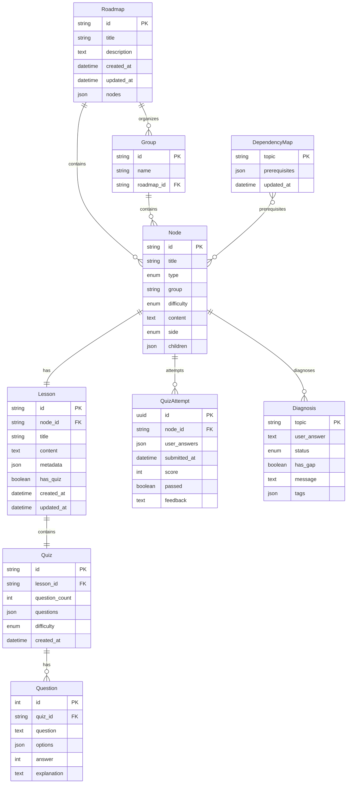

# ERD Completo

## Entidades do Sistema Roadmap Estudos

### Entidade: Roadmap

Armazena a estrutura completa de um roadmap de estudos.

| Atributo | Tipo | Descrição | Obrigatório |
|----------|------|-----------|-------------|
| id | VARCHAR(255) | Identificador único (derivado do nome do arquivo) | PK |
| title | VARCHAR(255) | Título do roadmap | Sim |
| description | TEXT | Descrição opcional do roadmap | Não |
| created_at | DATETIME | Data de criação (timestamp do arquivo) | Auto |
| updated_at | DATETIME | Data de última modificação | Auto |
| nodes | JSON | Array de objetos Node | Sim |

**Notas**: Implementado como arquivos JSON em `/data/roadmap_{tema}.json`

---

### Entidade: Node

Representa um tópico central ou subtopic dentro de um roadmap.

| Atributo | Tipo | Descrição | Obrigatório |
|----------|------|-----------|-------------|
| id | VARCHAR(255) | Identificador único do nó | PK |
| title | VARCHAR(255) | Título do tópico | Sim |
| type | ENUM | 'central' ou 'subtopic' | Sim |
| group | VARCHAR(255) | Nome do grupo/seção a qual pertence | Sim |
| difficulty | ENUM | 'easy', 'medium', 'hard' | Não |
| content | TEXT | Descrição breve do conteúdo | Não |
| side | ENUM | 'left' ou 'right' (para visualização) | Não |
| children | JSON | Array de IDs de nós filhos | Não |

**Notas**: Estrutura hierárquica onde nós centrais contêm subtopics. Cada nó pode referenciar uma lição correspondente em `/licoes/`.

---

### Entidade: Group

Agrupa nós logicamente dentro de um roadmap.

| Atributo | Tipo | Descrição | Obrigatório |
|----------|------|-----------|-------------|
| id | VARCHAR(255) | Identificador único do grupo | PK |
| name | VARCHAR(255) | Nome do grupo | Sim |
| roadmap_id | VARCHAR(255) | FK para Roadmap | Sim |

**Notas**: Grupos organizam os nós em seções lógicas (ex: "Fundamentos", "Python para Desenvolvimento")

---

### Entidade: Lesson

Armazena o conteúdo educacional de um tópico em formato Markdown.

| Atributo | Tipo | Descrição | Obrigatório |
|----------|------|-----------|-------------|
| id | VARCHAR(255) | Identificador único (nome do arquivo sem extensão) | PK |
| node_id | VARCHAR(255) | FK para Node (referência ao tópico) | FK |
| title | VARCHAR(255) | Título da lição | Sim |
| content | TEXT | Conteúdo em Markdown | Sim |
| metadata | JSON | Metadados (data, tags) | Não |
| has_quiz | BOOLEAN | Indica se contém quiz embutido | Sim |
| created_at | DATETIME | Data de criação | Auto |
| updated_at | DATETIME | Data de última modificação | Auto |

**Notas**: Implementado como arquivos `.md` em `/licoes/{node_id}.md`. Quiz embutido no final do arquivo em bloco ```json.

---

### Entidade: Quiz

Armazenado embutido em Lessons ou gerado dinamicamente via API.

| Atributo | Tipo | Descrição | Obrigatório |
|----------|------|-----------|-------------|
| id | VARCHAR(255) | Identificador único do quiz | PK |
| lesson_id | VARCHAR(255) | FK para Lesson | FK |
| question_count | INTEGER | Número de questões | Sim |
| questions | JSON | Array de objetos Question | Sim |
| difficulty | ENUM | Dificuldade estimada | Não |
| created_at | DATETIME | Data de criação | Auto |

**Notas**: Quiz pode estar embutido no arquivo Markdown ou ser gerado sob demanda via QuizService.

---

### Entidade: Question

Questão individual de múltipla escolha.

| Atributo | Tipo | Descrição | Obrigatório |
|----------|------|-----------|-------------|
| id | INTEGER | Identificador sequencial | PK |
| quiz_id | VARCHAR(255) | FK para Quiz | FK |
| question | TEXT | Texto da pergunta | Sim |
| options | JSON | Array de 4 alternativas | Sim |
| answer | INTEGER | Índice da resposta correta (0-3) | Sim |
| explanation | TEXT | Explicação da resposta correta | Não |

---

### Entidade: QuizAttempt

Tentativa de quiz (não persistente - transitória via API).

| Atributo | Tipo | Descrição | Obrigatório |
|----------|------|-----------|-------------|
| id | UUID | Identificador único da tentativa | PK |
| node_id | VARCHAR(255) | FK para Node/Lesson | FK |
| user_answers | JSON | Respostas do usuário (índice das alternativas) | Sim |
| submitted_at | DATETIME | Data de submissão | Auto |
| score | INTEGER | Pontuação obtida (0-100) | Result |
| passed | BOOLEAN | Indica se passou (threshold típico: 70%) | Result |
| feedback | TEXT | Feedback geral da avaliação | Result |

**Notas**: Não persistido em armazenamento permanente. Processado via `/api/evaluate-quiz`.

---

### Entidade: DependencyMap

Mapeia tópicos para seus pré-requisitos.

| Atributo | Tipo | Descrição | Obrigatório |
|----------|------|-----------|-------------|
| topic | VARCHAR(255) | Nome do tópico | PK |
| prerequisites | JSON | Array de IDs de tópicos pré-requisitos | Sim |
| updated_at | DATETIME | Data de última atualização | Auto |

**Notas**: Implementado como `/data/dep_map.json`. Gerado automaticamente a partir dos roadmaps existentes.

---

### Entidade: Diagnosis

Diagnóstico de lacuna de conhecimento (não persistente).

| Atributo | Tipo | Descrição | Obrigatório |
|----------|------|-----------|-------------|
| topic | VARCHAR(255) | Tópico avaliado | PK |
| user_answer | TEXT | Resposta do usuário | Sim |
| status | ENUM | 'hit' ou 'miss' | Result |
| has_gap | BOOLEAN | Indica se há lacuna identificada | Result |
| message | TEXT | Diagnóstico retornado pela IA | Result |
| tags | JSON | Tags de pré-requisitos relevantes | Result |

**Notas**: Não persistido. Processado via `/api/diagnose` usando DiagnosisService.

---

## Relacionamentos

```
Roadmap (1) ──── (N) Node
  │
  └── (N) Group ──── (1) Node
                    │
                    ├── (1) Lesson
                    │     └── (1) Quiz
                    │           └── (N) Question
                    │
                    ├── (1) QuizAttempt (transitório)
                    │
                    └── (1) Diagnosis (transitório)

DependencyMap (N) ──── (N) Node (via prerequisites)
```

### Cardinalidades

| Relacionamento | Tipo | Descrição |
|----------------|------|-----------|
| Roadmap → Node | 1:N | Um roadmap contém múltiplos nós |
| Group → Node | 1:N | Um grupo contém múltiplos nós |
| Node → Lesson | 1:1 | Cada nó possui uma lição correspondente |
| Lesson → Quiz | 1:1 | Cada lição contém um quiz (embutido) |
| Quiz → Question | 1:N | Um quiz contém múltiplas questões |
| Node → QuizAttempt | 1:N | Um nó pode ter múltiplas tentativas (histórico) |
| Node → Diagnosis | 1:N | Um nó pode ter múltiplos diagnósticos |
| DependencyMap → Node | N:M | Cada tópico pode ter múltiplos pré-requisitos |

---

## Diagrama ERD em Mermaid



---

## Notas de Implementação

### Persistência
- **Roadmap, Node, Group**: Armazenados em arquivos JSON (`/data/roadmap_*.json`)
- **Lesson**: Armazenada como arquivos Markdown (`/licoes/{node_id}.md`)
- **Quiz/Question**: Embutilo no final das lições em formato JSON
- **QuizAttempt, Diagnosis**: Não persistidos (processamento transitório via API)

### Integridade Referencial
- O sistema não utiliza banco de dados relacional formal
- Integridade mantida via convenções de nomenclatura (node_id corresponde ao nome do arquivo da lição)
- Mapa de dependências é regenerado automaticamente a partir dos roadmaps existentes

### Escalabilidade
- Modelo de armazenamento em arquivo é adequado para volumes pequenos/médios
- Para escala maior, considerar migração para banco de dados relacional (PostgreSQL) ou NoSQL (MongoDB)