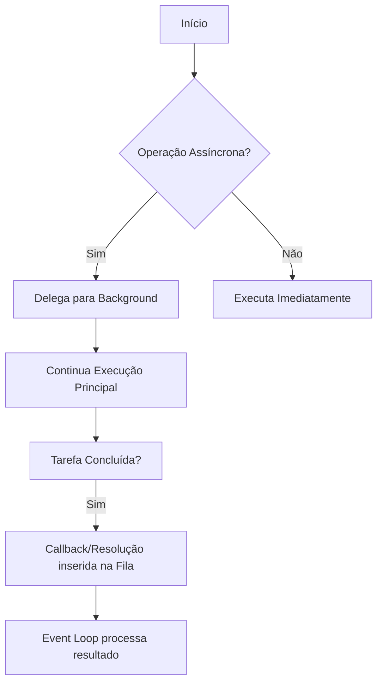

# Programação Assíncrona

## 🎯 Resumo Executivo
A programação assíncrona é um paradigma que permite que uma tarefa seja executada em segundo plano, sem bloquear a linha de execução principal (main thread). Ela é essencial para criar sistemas responsivos e eficientes, permitindo que o software lide com operações de entrada/saída (I/O) demoradas sem interromper a interação do usuário ou o processamento de outras requisições.

## 📚 Conceitos-Chave

1.  **Não-bloqueio (Non-blocking):** Ao contrário do modelo síncrono, onde o código espera uma tarefa terminar para ir à próxima, o modelo assíncrono inicia a tarefa e "agenda" o que deve ser feito quando ela terminar, liberando o processador imediatamente.
2.  **Promises/Futures:** Objetos que representam o eventual sucesso ou falha de uma operação assíncrona. Eles funcionam como um "comprovante" de que um valor será entregue no futuro.
3.  **Async/Await:** Açúcar sintático moderno que permite escrever código assíncrono com uma aparência síncrona, facilitando a leitura e a manutenção.
4.  **Event Loop:** O mecanismo que monitora a pilha de execução e a fila de tarefas, decidindo quando uma função de retorno (callback) deve ser executada após a conclusão de uma tarefa assíncrona.



## 💡 Aplicação Prática

*   **Chamadas de API (Network I/O):** Ao buscar dados de um servidor remoto, o aplicativo não "congela". Ele exibe um ícone de carregamento enquanto a rede processa a requisição assincronamente.
*   **Acesso ao Sistema de Arquivos (Disk I/O):** Ler um arquivo de 2GB do disco. Em vez de parar todo o servidor, a aplicação solicita a leitura e continua atendendo outros usuários até que os dados estejam prontos.

## ⚠️ Erros Comuns

1.  **Esquecer o `await`:** Chamar uma função assíncrona sem aguardar seu resultado faz com que o código receba a *Promise* em si, e não o valor esperado, gerando erros de lógica.
2.  **Async/Await dentro de Loops Síncronos:** Usar `forEach` com funções assíncronas muitas vezes resulta em execuções que não respeitam a ordem desejada ou que não são devidamente aguardadas.
3.  **Callback Hell:** Aninhar múltiplas funções de retorno umas dentro das outras, tornando o código ilegível (resolvido modernamente com Promises e Async/Await).

## ✅ Checklist de Domínio

*   [ ] Consigo explicar a diferença entre execução bloqueante e não-bloqueante?
*   [ ] Sei identificar quando uma função deve ser marcada como `async`?
*   [ ] Entendo que "assíncrono" não significa necessariamente "paralelismo" (multithreading)?
*   [ ] Consigo tratar erros em fluxos assíncronos usando blocos `try/catch`?

```json
[
  {
    "question": "Qual é a principal vantagem da programação assíncrona em relação à síncrona?",
    "options": [
      "Aumentar a velocidade bruta de processamento da CPU",
      "Permitir que o programa continue executando outras tarefas enquanto aguarda operações de I/O",
      "Garantir que o código seja executado sempre na ordem exata em que foi escrito",
      "Eliminar a necessidade de tratar erros no código"
    ],
    "answer": 1
  },
  {
    "question": "O que acontece se você chamar uma função 'async' sem utilizar a palavra-chave 'await' (ou .then)?",
    "options": [
      "O programa trava imediatamente",
      "A função é convertida automaticamente em síncrona",
      "Você recebe um objeto (Promise/Future) em vez do valor de retorno final",
      "O compilador gera um erro e impede a execução"
    ],
    "answer": 2
  },
  {
    "question": "Sobre o Event Loop, qual é sua função primordial na programação assíncrona?",
    "options": [
      "Criar novas threads para cada função do sistema",
      "Interromper o hardware caso uma tarefa demore muito",
      "Gerenciar a fila de mensagens e decidir quando executar as tarefas agendadas",
      "Criptografar os dados enviados assincronamente"
    ],
    "answer": 2
  }
]
```