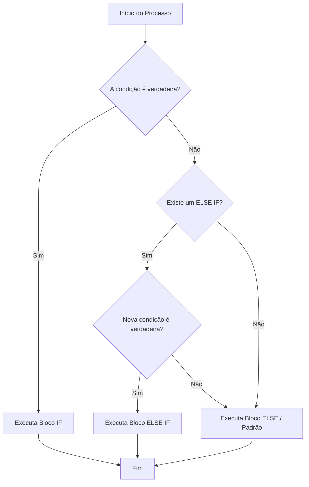

# O Dominínio do Fluxo: Estruturas Condicionais

## 📋 Metadados
*   **Título:** Estruturas Condicionais (if/else, switch)
*   **Data:** 23 de Maio de 2024
*   **Tags:** #SoftwareEngineering #Fullstack #Logic #Gamification #CleanCode

---

## 🎯 Resumo Executivo
Como desenvolvedor Fullstack, controlar o fluxo da aplicação é como desenhar as regras de um jogo (mecânicas). As estruturas condicionais permitem que o software tome decisões baseadas em estados. Nesta lição, exploraremos não apenas a sintaxe, mas a **estratégia** de quando usar `if/else` vs. `switch`, focando em legibilidade, performance e manutenção (Clean Code).

---

## 📚 Conteúdo Detalhado

### 1. A Anatomia da Decisão
No desenvolvimento Fullstack, as decisões ocorrem em todos os níveis: no Frontend (ex: exibir um botão se o usuário estiver logado) e no Backend (ex: validar permissões de acesso).

#### O Fluxo de Decisao (Mermaid)


### 2. IF/ELSE: O Canivete Suíço
Ideal para verificações booleanas complexas ou intervalos de valores.
*   **Uso Recomendado:** Validações, checagem de nulos, lógicas booleanas compostas (`&&`, `||`).
*   **Exemplo Clean Code:** Evite o "Código Arrow" (muitos if's aninhados). Use *Guard Clauses* (retornos antecipados).

### 3. SWITCH: O Organizador de Estados
Ideal para quando uma única variável pode assumir múltiplos valores discretos (Enums, Strings de status).
*   **Uso Recomendado:** Máquinas de estado, tratamento de rotas, códigos de erro HTTP.
*   **Vantagem:** Maior legibilidade quando há mais de 3 ou 4 opções para a mesma variável.

---

## 💡 Insights e Conexões

### A Camada de Gamificação: "Early Return"
Em Engenharia de Software, aplicar a estratégia de **Early Return** (Retorno Antecipado) é como criar um "atalho" no seu código. Em vez de envolver todo o seu código em um `else` gigante, você verifica o erro primeiro e sai da função. Isso reduz a carga cognitiva de quem lê o código.

**Exemplo Fullstack (Node.js/React):**
```javascript
// Ruim (Aninhado)
if (user) {
  if (user.isAdmin) {
    showDashboard();
  }
}

// Bom (Early Return - Estilo Engenharia)
if (!user) return;
if (!user.isAdmin) return;
showDashboard();
```

---

## ✅ Checklist
- [ ] Compreendo a diferença de performance (irrelevante para poucos casos, mas o switch é otimizado via *jump tables* em certas linguagens).
- [ ] Sei aplicar *Guard Clauses* para evitar aninhamentos desnecessários.
- [ ] Identifico quando um `switch` torna o código mais legível que múltiplos `if/else`.
- [ ] Lembro-me sempre de usar o `break` (ou `return`) dentro de blocos `switch` para evitar o *fall-through*.

---

## 📝 Quiz de Validação

```json
[
  {
    "question": "Qual é a técnica de refatoração recomendada para evitar o aninhamento excessivo de condicionais 'if'?",
    "options": [
      "Inheritance Loop",
      "Guard Clauses (Retorno Antecipado)",
      "Switch Case Nesting",
      "Boolean Injection"
    ],
    "answer": 1
  },
  {
    "question": "Em qual cenário a estrutura 'switch' é geralmente preferível ao 'if/else' em termos de legibilidade?",
    "options": [
      "Quando precisamos testar intervalos numéricos (ex: x > 10 e x < 20)",
      "Quando temos apenas uma condição booleana simples",
      "Quando uma única variável possui múltiplos valores discretos e fixos para serem comparados",
      "Sempre, pois o switch é 100% mais rápido em qualquer linguagem"
    ],
    "answer": 2
  },
  {
    "question": "O que acontece em um bloco 'switch' se o comando 'break' for omitido após um 'case' que foi correspondido?",
    "options": [
      "O código gera um erro de compilação imediatamente",
      "A execução continua para o próximo 'case' (fall-through), mesmo que a condição não combine",
      "O programa entra em um loop infinito",
      "O bloco 'default' é executado e o programa para"
    ],
    "answer": 1
  }
]
```