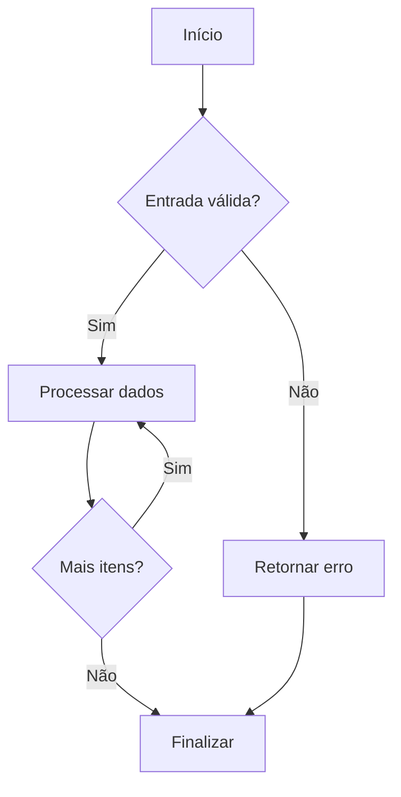

# Programação Estruturada: Fundamentos e Boas‑Práticas para Fullstack

## 📋 Metadados
- **Título:** Programação Estruturada – Conceitos, Técnicas e Aplicação no Desenvolvimento Fullstack  
- **Data:** 2024‑06‑20  
- **Tags:** #ProgramaçãoEstruturada #EngenhariaDeSoftware #Fullstack #Gamificação #BoasPráticas  

## 🎯 Resumo Executivo
A Programação Estruturada (PE) é um paradigma clássico que organiza o código em blocos lógicos claros — sequência, seleção e iteração — promovendo legibilidade, manutenção e teste. Mesmo em ambientes modernos (Node.js, React, APIs REST), aplicar os princípios da PE reduz a complexidade de sistemas fullstack, facilita a colaboração entre front‑ e back‑end e cria bases sólidas para a migração a paradigmas mais avançados (orientação a objetos, programação funcional). Nesta lição, você vai:

1. Revisar os pilares da programação estruturada.  
2. Aprender a modelar fluxos usando diagramas de fluxo (Mermaid).  
3. Identificar como incorporar PE em rotinas de back‑end (Express, Django) e front‑end (React hooks, componentes funcionais).  
4. Consolidar o aprendizado com um checklist prático e um quiz de validação.  

---

## 📚 Conteúdo Detalhado

### 1. Princípios Básicos da Programação Estruturada
| Princípio | Descrição | Benefício |
|-----------|-----------|-----------|
| **Sequência** | Execução linear de instruções. | Simplicidade de leitura. |
| **Seleção** | Estruturas condicionais (`if/else`, `switch`). | Controle de fluxo decisório. |
| **Iteração** | Loops (`for`, `while`, `do‑while`). | Repetição de lógica sem duplicação. |
| **Modularização** | Divisão em sub‑rotinas ou funções. | Reuso, teste isolado, manutenção. |

> **Gamificação:** Pense em cada módulo como uma “missão” que deve ser completada antes de avançar ao próximo nível.

### 2. Estruturando o Código no Back‑end (Node.js/Express)

```js
// exemplo de módulo estruturado: rota de usuário
// 1️⃣ Importações
const express = require('express');
const router = express.Router();
const UserService = require('../services/userService');

// 2️⃣ Funções auxiliares (modularização)
function validarPayload(payload) {
  // ...validação...
  return true;
}

// 3️⃣ Rotas (sequência & seleção)
router.post('/signup', async (req, res) => {
  if (!validarPayload(req.body)) {
    return res.status(400).json({ error: 'Payload inválido' });
  }

  try {
    const user = await UserService.criarUsuario(req.body);
    res.status(201).json(user);
  } catch (err) {
    // 4️⃣ Tratamento de erros (iteração de fallback)
    res.status(500).json({ error: err.message });
  }
});

module.exports = router;
```

### 3. Estruturando o Código no Front‑end (React)

```tsx
// Hook customizado usando programação estruturada
import { useState, useEffect } from 'react';

export function useFetch<T>(url: string) {
  // 1️⃣ Estado inicial (sequência)
  const [data, setData] = useState<T | null>(null);
  const [loading, setLoading] = useState(true);
  const [error, setError] = useState<string | null>(null);

  // 2️⃣ Efeito colateral (iteração)
  useEffect(() => {
    let isMounted = true; // controle de ciclo de vida
    async function fetchData() {
      try {
        const response = await fetch(url);
        if (!response.ok) throw new Error('Falha na requisição');
        const result = (await response.json()) as T;
        if (isMounted) setData(result);
      } catch (e) {
        if (isMounted) setError((e as Error).message);
      } finally {
        if (isMounted) setLoading(false);
      }
    }
    fetchData();
    // 3️⃣ Cleanup (seleção)
    return () => { isMounted = false };
  }, [url]);

  // 4️⃣ Retorno (sequência)
  return { data, loading, error };
}
```

### 4. Modelando Fluxos com Mermaid



**Interpretando o diagrama:**  
- **Sequência**: A → B → C → D → … → E  
- **Seleção**: `Entrada válida?` e `Mais itens?` (condicionais)  
- **Iteração**: Laço entre C e D (processamento de coleção)  

### 5. Boas‑Práticas de Gamificação Aplicadas à PE
| Estratégia | Como aplicar na programação estruturada |
|------------|------------------------------------------|
| **Feedback imediato** | Logar mensagens de sucesso/erro logo após cada bloco (ex.: `console.log('Usuário criado')`). |
| **Desafios incrementais** | Quebrar funcionalidades grandes em “sub‑quests” (funções menores). |
| **Leaderboard de qualidade** | Métricas de cobertura de testes por módulo; premiar quem atingir 90%+. |
| **Narrativa** | Nomear funções e módulos como “missões” (`criarUsuario`, `validarPayload`). |

---

## 💡 Insights e Conexões
- **Transição para OOP:** A modularização da PE é a porta de entrada para classes e objetos—cada módulo pode evoluir para um objeto com estado próprio.  
- **Programação Funcional:** Loops estruturados podem ser substituídos por funções de alta ordem (`map`, `reduce`), mantendo a clareza lógica.  
- **DevOps & CI/CD:** Scripts de build que seguem PE (sequência clara de etapas) são mais fáceis de automatizar e depurar.  
- **Escalabilidade Fullstack:** Manter PE tanto no server quanto no client garante consistência de estilo, facilitando a troca de desenvolvedores entre camadas.  

---

## ✅ Checklist
- [ ] **Sequência**: Todas as funções têm fluxo linear claro, sem jumps (`goto`).  
- [ ] **Seleção**: Condicionais são usadas ao invés de código duplicado.  
- [ ] **Iteração**: Loops substituem repetições manuais; preferir `for...of` ou `while`.  
- [ ] **Modularização**: Cada responsabilidade está isolada em módulos/funções de até 30 linhas.  
- [ ] **Teste Unitário**: Cada módulo possui pelo menos um teste que cobre 80% do código.  
- [ ] **Documentação**: Cada função tem JSDoc/TS Doc descrevendo parâmetros e retorno.  
- [ ] **Feedback**: Logs ou mensagens de UI dão retorno ao usuário imediatamente após cada ação.  

---  

```json
[
  {
    "question": "Qual dos itens a seguir NÃO faz parte dos princípios básicos da Programação Estruturada?",
    "options": ["Sequência", "Recursão", "Seleção", "Iteração"],
    "answer": 1
  },
  {
    "question": "Em um componente React, qual técnica abaixo exemplifica melhor a modularização segundo a Programação Estruturada?",
    "options": [
      "Criar um hook customizado que encapsula a lógica de fetch",
      "Usar o `useEffect` diretamente no JSX",
      "Escrever a lógica de fetch dentro do `return` do componente",
      "Misturar estado local e global no mesmo hook"
    ],
    "answer": 0
  },
  {
    "question": "No diagrama Mermaid apresentado, qual elemento representa a estrutura de iteração?",
    "options": [
      "O nó 'Início'",
      "O bloco de decisão 'Entrada válida?'",
      "A seta que volta de 'Processar dados' para 'Mais itens?'",
      "O nó 'Finalizar'"
    ],
    "answer": 2
  }
]
```