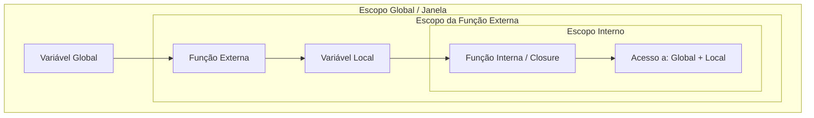

# Funções e Escopo: A Engenharia da Reutilização e Isolamento

## 📋 Metadados
- **Título:** Domínio de Funções e Escopos em Arquiteturas Fullstack
- **Data:** 24 de Maio de 2024
- **Tags:** #SoftwareEngineering #CleanCode #JavaScript #Backend #ProgrammingFundamentals #Gamification

---

## 🎯 Resumo Executivo
Na engenharia de software, funções não são apenas "blocos de código que executam tarefas", mas as unidades fundamentais de **encapsulamento**. Nesta lição, exploraremos como a definição de escopo (Global, Módulo, Bloco e Função) dita a visibilidade e a vida útil das variáveis. Para um desenvolvedor Fullstack, entender esses conceitos é a diferença entre um código escalável e um sistema repleto de *memory leaks* e efeitos colaterais imprevisíveis.

---

## 📚 Conteúdo Detalhado

### 1. Anatomia de uma Função de Elite
Uma função bem projetada deve seguir o princípio de responsabilidade única (SRP). No contexto Fullstack, funções podem ser síncronas (cálculos de lógica de negócio) ou assíncronas (chamadas de API ou acesso ao banco de dados).

### 2. A Hierarquia de Escopos
O escopo determina onde uma variável pode ser acessada. Imagine o escopo como as "camadas de acesso" de um sistema de RPG:

*   **Escopo Global:** O "Mapa Mundi". Acessível por qualquer script. Perigoso se poluído.
*   **Escopo de Módulo:** O "Reino". Variáveis visíveis apenas dentro do arquivo.
*   **Escopo de Bloco (let/const):** A "Masmorra". Variáveis que morrem assim que o bloco `{}` termina.

### 3. Visualização de Fluxo e Escopo (Closure)

O Mermaid abaixo ilustra como uma função interna mantém acesso ao seu escopo pai mesmo após a execução da função externa (um conceito vital para Middlewares e Callbacks).



### 4. Hoisting e Shadowing
*   **Hoisting:** O comportamento onde declarações de funções e variáveis (var) são elevadas ao topo do escopo durante a fase de compilação.
*   **Shadowing:** Quando uma variável em um escopo interno tem o mesmo nome de uma variável no escopo externo, "escondendo" a externa temporariamente.

---

## 💡 Insights e Conexões

1.  **Conexão Fullstack:** No Node.js, cada arquivo é tratado como um módulo. Isso significa que o "Escopo Global" no navegador (`window`) se comporta de forma diferente do `global` no servidor.
2.  **Dica de Performance:** Minimize o uso do escopo global. Variáveis globais permanecem na memória enquanto a aba (ou o processo do servidor) estiver ativa, prejudicando o *Garbage Collection*.
3.  **Clean Code:** Prefira Funções Puras (Pure Functions). Elas não dependem e não alteram o estado externo, o que facilita testes unitários e previsibilidade.

---

## ✅ Checklist

- [ ] Substituí todos os `var` por `let` ou `const`.
- [ ] Garanti que minhas funções não possuem mais de 20 linhas (regra de ouro).
- [ ] Verifiquei se não há vazamento de variáveis globais acidentais.
- [ ] Utilizei *Arrow Functions* apenas quando não necessito de um contexto de `this` próprio.

---

## 🎮 Quiz de Validação

```json
[
  {
    "question": "O que acontece se uma variável é declarada com 'const' dentro de um bloco 'if' e tentamos acessá-la fora desse bloco?",
    "options": [
      "A variável é acessível normalmente devido ao Hoisting.",
      "A variável retorna 'undefined'.",
      "Ocorre um erro de referência (ReferenceError), pois 'const' tem escopo de bloco.",
      "A variável é automaticamente promovida ao escopo global."
    ],
    "answer": 2
  },
  {
    "question": "Qual é a principal característica de uma 'Closure'?",
    "options": [
      "É uma função que não pode ser chamada mais de uma vez.",
      "É a capacidade de uma função lembrar e acessar seu escopo léxico mesmo quando executada fora dele.",
      "É um método para fechar conexões com o banco de dados automaticamente.",
      "É uma função que só aceita argumentos do tipo string."
    ],
    "answer": 1
  },
  {
    "question": "Sobre 'Shadowing' de variáveis, qual afirmação é correta?",
    "options": [
      "É um erro de sintaxe que impede a compilação do código.",
      "Ocorre quando uma função é declarada dentro de outra sem usar 'return'.",
      "Ocorre quando uma variável em um escopo interno sobrescreve visualmente o acesso a uma variável de mesmo nome em um escopo externo.",
      "É uma técnica de segurança para esconder senhas no frontend."
    ],
    "answer": 2
  }
]
```