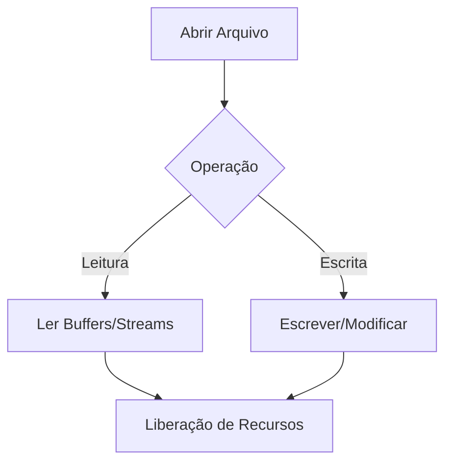
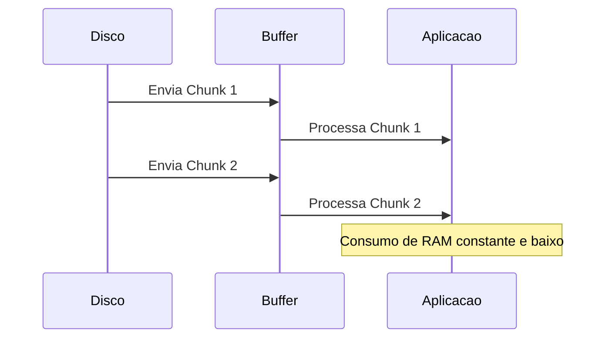

# Manipulação de Arquivos I/O: O Fluxo Vital dos Dados

## 📋 Metadados
*   **Título:** Fundamentos de File I/O (Input/Output)
*   **Data:** 24 de Maio de 2024
*   **Tags:** #Backend #Fullstack #NodeJS #FileSystem #Performance

## 🎯 Resumo Executivo
A manipulação de arquivos consiste em ler e escrever dados em meios de armazenamento persistente. Para um Fullstack, isso significa entender a diferença entre operações **Síncronas** (bloqueantes) e **Assíncronas** (não-bloqueantes), além de saber quando usar **Buffer** vs **Streams** para evitar o consumo excessivo de memória (RAM) em servidores.

## 📚 Conteúdo Detalhado

### 1. O Ciclo de Vida do Arquivo
Toda interação com o sistema de arquivos segue um ritual técnico. Se você pular uma etapa (como fechar o arquivo), causará um *Memory Leak*.



### 2. Síncrono vs. Assíncrono (O dilema do Node.js)
No desenvolvimento Fullstack (especialmente com Node.js), usar métodos `Sync` em produção é um "erro crítico de level 1". Isso congela a *Event Loop*, impedindo que outros usuários acessem sua API.

*   **Síncrono (readFileSync):** Útil apenas em scripts de inicialização (CLI).
*   **Assíncrono (readFile/Promises):** O padrão ouro para APIs escaláveis.

### 3. Streams: O "Power-up" da Performance
Imagine ler um arquivo de 2GB. Se você usar `fs.readFile`, seu servidor tentará colocar 2GB na RAM de uma vez. O servidor vai travar.
**Streams** fatiam o arquivo em pedaços (*chunks*) e os processam sob demanda.



## 💡 Insights e Conexões
*   **Segurança (Vulnerabilidade de Path Traversal):** Nunca confie no nome de arquivo enviado pelo frontend. Um usuário malicioso pode enviar `../../etc/passwd` para ler arquivos sensíveis do seu servidor. Sempre sanitize os caminhos.
*   **Cloud Context:** Em infraestruturas modernas (Serverless/Lambda), o sistema de arquivos local é efêmero. Use I/O local para processamento temporário, mas persista o resultado final em storages como AWS S3 ou Google Cloud Storage.

## ✅ Checklist
- [ ] Entendi a diferença entre `fs.readFileSync` e `fs.promises.readFile`.
- [ ] Sei quando usar *Streams* para arquivos grandes.
- [ ] Implementei tratamento de erros (`try/catch` ou `.catch`) para arquivos inexistentes.
- [ ] Garanti que o fechamento do arquivo/stream ocorra para evitar vazamento de descritores.

---

### 📝 Quiz de Validação (XP Game)

```json
[
  {
    "question": "Qual é o principal risco de utilizar funções síncronas (Sync) de I/O em um servidor Node.js com alto tráfego?",
    "options": [
      "Aumento da segurança dos dados gravados.",
      "Bloqueio da Event Loop, impedindo o processamento de outras requisições.",
      "Redução automática do tamanho dos arquivos no disco.",
      "Melhoria no tempo de resposta para usuários mobile."
    ],
    "answer": 1
  },
  {
    "question": "Se você precisa processar um log de 10GB sem esgotar a memória RAM do servidor, qual técnica é a mais indicada?",
    "options": [
      "Carregar o arquivo inteiro com fs.readFile() e usar um loop for.",
      "Aumentar a memória física (RAM) do servidor para 16GB.",
      "Utilizar Streams (ReadStream) para processar o arquivo em pequenos pedaços (chunks).",
      "Converter o arquivo para JSON antes de realizar a leitura."
    ],
    "answer": 2
  },
  {
    "question": "Sobre segurança na manipulação de caminhos de arquivos (File Paths), o que o desenvolvedor Fullstack deve evitar?",
    "options": [
      "Usar a biblioteca 'path' integrada para concatenar caminhos.",
      "Concatenar diretamente inputs do usuário com diretórios locais sem sanitização.",
      "Armazenar arquivos fora da pasta raiz da aplicação.",
      "Utilizar caminhos absolutos em vez de caminhos relativos."
    ],
    "answer": 1
  }
]
```