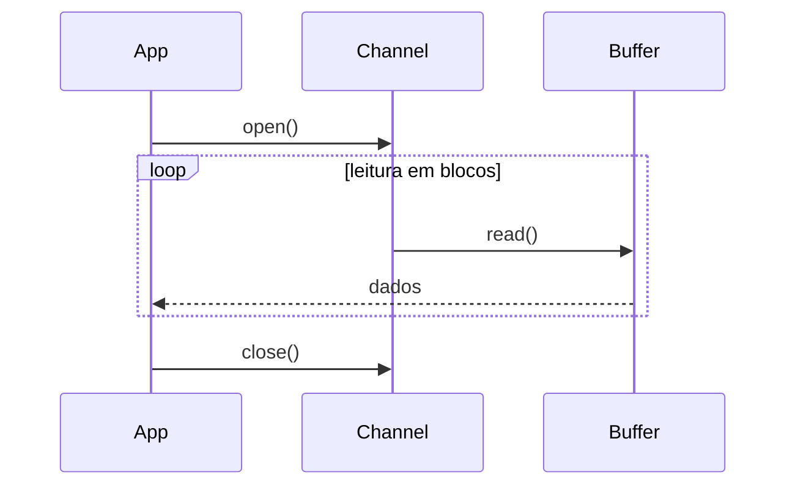

# Manipulação de Arquivos I/O para Desenvolvedores Fullstack  

## 📋 Metadados  
- **Título:** Manipulação de Arquivos I/O  
- **Data:** 2024-10-01  
- **Tags:** #Fullstack #NodeJS #Python #Java #I/O #Gamificação #EngenhariaDeSoftware  

## 🎯 Resumo Executivo  
Nesta lição, você vai dominar as técnicas essenciais para ler, escrever e gerenciar arquivos em ambientes **backend** (Node.js, Python, Java) e **frontend** (Web APIs, IndexedDB). Abordaremos boas práticas de performance, segurança (sanitização de paths, controle de permissões) e como transformar operações de I/O em **missões** gamificadas que aumentam a produtividade da equipe. Ao final, você será capaz de:

1. Escolher a API de I/O adequada ao seu stack.  
2. Implementar leitura e escrita assíncrona com tratamento de erros.  
3. Aplicar padrões de design (Facade, Strategy) para abstrair o acesso a arquivos.  
4. Integrar armazenamento local no browser e sincronizar com o backend.  

## 📚 Conteúdo Detalhado  

### 1️⃣ Conceitos Fundamentais  
| Conceito | Descrição |
|----------|-----------|
| **Sincrono vs Assíncrono** | Operações bloqueantes (ex.: `fs.readFileSync`) vs não bloqueantes (`fs.promises.readFile`). |
| **Streams** | Leitura/escrita incremental, ideal para arquivos grandes. |
| **Buffers** | Estrutura de memória binária; usada em Node.js e Python (`bytes`). |
| **Encoding** | UTF‑8, UTF‑16, Binary; importância ao converter entre texto e binário. |
| **Permissões (chmod, umask)** | Controle de leitura/escrita/execução em sistemas POSIX. |

### 2️⃣ Node.js – API `fs` (Filesystem)  
```js
const fs = require('fs').promises;

// 📂 Leitura assíncrona com tratamento de erros
async function readJSON(path) {
  try {
    const data = await fs.readFile(path, 'utf8');
    return JSON.parse(data);
  } catch (err) {
    console.error('❗ Falha ao ler o arquivo:', err);
    throw err;
  }
}

// ✍️ Escrita segura (atomic) usando write‑temp + rename
async function writeJSON(path, obj) {
  const tmp = `${path}.tmp`;
  await fs.writeFile(tmp, JSON.stringify(obj, null, 2), 'utf8');
  await fs.rename(tmp, path); // garante atomicidade
}
```

#### 2.1 Streams em Node  
```mermaid
flowchart TD
    A[CreateReadStream] --> B[Chunk 64KB]
    B --> C[Transform (e.g., gzip)]
    C --> D[WriteStream (output.txt)]
    style A fill:#f9f,stroke:#333,stroke-width:2px
    style D fill:#bbf,stroke:#333,stroke-width:2px
```

*Use streams para processar logs de tamanho gigabytes sem sobrecarregar a memória.*

### 3️⃣ Python – Módulo `io` e `pathlib`  
```python
from pathlib import Path
import json

def read_json(file_path: Path) -> dict:
    try:
        return json.loads(file_path.read_text(encoding='utf-8'))
    except Exception as e:
        print(f'❗ Erro ao ler {file_path}: {e}')
        raise

def write_json_atomic(file_path: Path, data: dict):
    tmp = file_path.with_suffix('.tmp')
    tmp.write_text(json.dumps(data, indent=2), encoding='utf-8')
    tmp.replace(file_path)  # atomic rename
```

#### 3.1 Buffered I/O  
```python
with open('large.bin', 'rb') as f:
    while chunk := f.read(8192):
        process(chunk)  # processa em blocos
```

### 4️⃣ Java – NIO (New I/O)  
```java
Path path = Paths.get("config.json");
try {
    // Leitura assíncrona (CompletableFuture)
    CompletableFuture<String> content = Files.readStringAsync(path, StandardCharsets.UTF_8);
    content.thenAccept(System.out::println);
} catch (IOException e) {
    e.printStackTrace();
}
```

#### 4.1 Canal e Buffer  


### 5️⃣ Frontend – Web APIs  
| API | Caso de Uso | Exemplo |
|-----|-------------|---------|
| **FileReader** | Ler arquivos selecionados por `<input type="file">` | `reader.readAsText(file)` |
| **Blob & URL.createObjectURL** | Gerar downloads dinamicamente | `const url = URL.createObjectURL(blob)` |
| **IndexedDB** | Armazenamento local estruturado (offline) | `db.transaction(...).objectStore(...).add(data)` |
| **File System Access API** *(Chrome/Edge)* | Acesso real ao sistema de arquivos do usuário (sandbox) | `window.showSaveFilePicker()` |

#### 5.1 Fluxo de Upload com Progressão  
```mermaid
flowchart LR
    A[Seleção de Arquivo] --> B[FileReader.readAsArrayBuffer]
    B --> C[XMLHttpRequest (PUT) + onprogress]
    C --> D[Servidor Recebe & Salva]
    D --> E[Resposta OK]
```

### 6️⃣ Estratégias de Gamificação  

| Gamificação | Como aplicar ao I/O |
|-------------|----------------------|
| **Quests (Missões)** | “Implemente um serviço de upload resumível usando streams.” |
| **Badges** | Conceder badge **“File Ninja”** ao completar leitura/escrita atômica. |
| **Leaderboards** | Métricas de tempo de processamento de arquivos; quem otimiza mais ganha pontos. |
| **XP por Refactor** | Cada troca de código síncrono para assíncrono gera XP. |

## 💡 Insights e Conexões  

1. **Performance ≠ Simplicidade:** Operações síncronas são fáceis, mas bloqueiam o event‑loop. Em servidores de alta concorrência, prefira streams e APIs async.  
2. **Segurança Primeiro:** Sempre sanitize paths (`path.normalize`, `os.path.abspath`) para prevenir **Path Traversal**.  
3. **Atomicidade:** Escritura atômica evita corrupção de dados em caso de falha ou concorrência. Use `rename` ou transações de banco para garantir.  
4. **Cross‑Stack Consistency:** Defina um contrato (ex.: JSON Schema) que tanto o backend (Node/Java) quanto o frontend (IndexedDB) compartilhem.  
5. **Observabilidade:** Logs de I/O devem incluir tamanho, tempo de operação e hash de verificação para auditoria.  

## ✅ Checklist  

- [ ] Entender diferenças entre I/O síncrono e assíncrono.  
- [ ] Implementar leitura/escrita usando **streams** no Node.js.  
- [ ] Aplicar escrita atômica em Python/Node/Java.  
- [ ] Usar **FileReader** e **IndexedDB** para manipular arquivos no browser.  
- [ ] Aplicar sanitização de caminhos e controle de permissões.  
- [ ] Criar ao menos uma *quest* gamificada envolvendo upload resumível.
