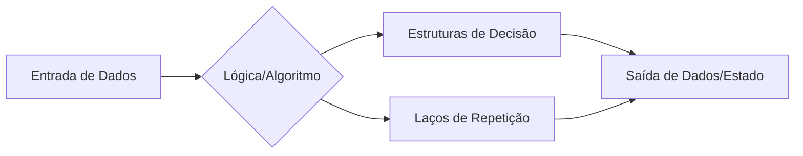
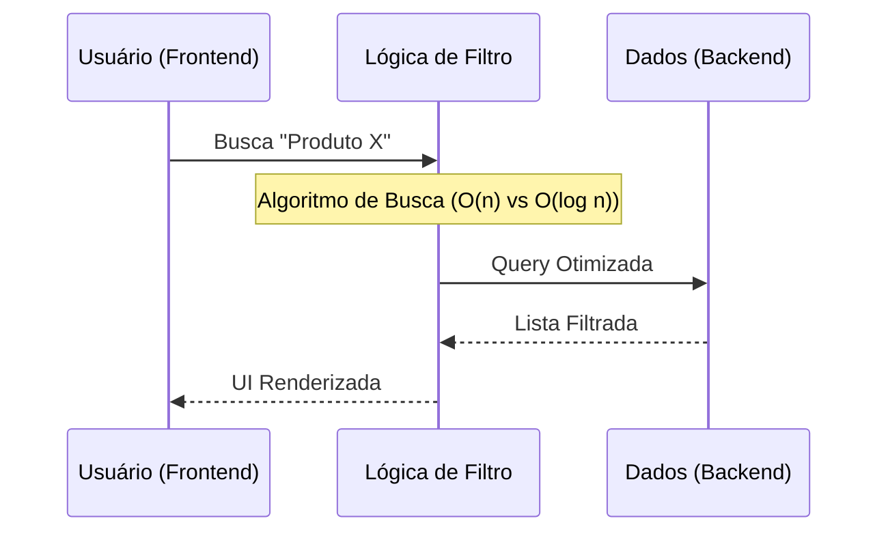

# Lógica de Programação de Alta Performance para Fullstack

## 📋 Metadados
- **Título:** A Espinha Dorsal do Código: Lógica, Algoritmos e Complexidade
- **Data:** 24 de Maio de 2024
- **Tags:** #Logic #Algorithms #Fullstack #CleanCode #DataStructures

---

## 🎯 Resumo Executivo
Para um desenvolvedor Fullstack, a lógica de programação transcende o simples "escrever código que funciona". Ela é a capacidade de decompor problemas complexos (seja no processamento de dados no Backend ou na manipulação de estados no Frontend) em instruções atômicas e otimizadas. Esta lição aborda a estruturação de pensamentos algorítmicos, a importância das estruturas de controle e como o fluxo de dados se comporta em uma aplicação moderna.

---

## 📚 Conteúdo Detalhado

### 1. O Ciclo da Resolução de Problemas
Antes de tocar no teclado, o desenvolvedor deve processar o problema em três camadas: **Entrada**, **Processamento** e **Saída**.



### 2. Estruturas Fundamentais
*   **Condicionais (If/Else, Switch):** A base da tomada de decisão. No Fullstack, usamos para renderização condicional (React/Vue) ou validação de regras de negócio (Node.js/Python).
*   **Iterações (Loops):** Fundamentais para manipular listas (Arrays de objetos vindos de uma API). O foco aqui deve ser o uso de métodos funcionais como `.map()`, `.filter()` e `.reduce()`, que são versões evoluídas e mais legíveis dos laços tradicionais.

### 3. Algoritmos e Complexidade (Big O)
Um desenvolvedor sênior não apenas resolve o problema, mas o resolve de forma eficiente. No Frontend, um algoritmo ineficiente trava a UI (User Interface); no Backend, ele encarece a fatura da nuvem (AWS/Azure).



---

## 💡 Insights e Conexões
*   **A Lógica é Agnóstica:** Aprender a lógica de programação permite que você migre de um framework (como React) para outro (como Angular) ou mude a linguagem do Backend sem grandes traumas.
*   **Gamificação no Aprendizado:** Encare cada bug como um "Boss" de um jogo. Para vencê-lo, você precisa mapear o padrão de ataque (input) e planejar sua defesa (lógica de tratamento de erro).
*   **Conexão Fullstack:** No Frontend, a lógica foca em **Experiência do Usuário (UX)** e reatividade. No Backend, o foco é **Consistência de Dados** e escalabilidade.

---

## ✅ Checklist
- [ ] Identificar a entrada, o processamento e a saída de qualquer funcionalidade.
- [ ] Escolher a estrutura de repetição mais eficiente (evitar loops aninhados desnecessários).
- [ ] Validar se a lógica suporta casos de borda (Edge Cases), como valores nulos ou vazios.
- [ ] Documentar o fluxo lógico através de comentários ou pseudocódigo antes da implementação.

---

```json
[
  {
    "question": "Qual é a principal diferença de aplicação da lógica de programação entre o Frontend e o Backend em um contexto Fullstack?",
    "options": [
      "No Frontend a lógica não existe, apenas no Backend.",
      "No Frontend a lógica foca em manipulação de DOM e Estado; no Backend foca em persistência e regras de negócio.",
      "As linguagens de Backend não permitem o uso de estruturas condicionais como o If/Else.",
      "O Frontend utiliza apenas lógica linear, enquanto o Backend utiliza apenas lógica recursiva."
    ],
    "answer": 1
  },
  {
    "question": "Em termos de eficiência (Big O), por que um desenvolvedor deve evitar loops aninhados (um for dentro de outro for) ao lidar com grandes volumes de dados?",
    "options": [
      "Porque o código fica visualmente feio, embora o desempenho seja o mesmo.",
      "Porque loops aninhados dobram o tempo de execução independente do tamanho dos dados.",
      "Porque eles aumentam a complexidade para O(n²), o que pode degradar drasticamente a performance com muitos dados.",
      "Porque as linguagens modernas como JavaScript não suportam mais de um loop por função."
    ],
    "answer": 2
  },
  {
    "question": "O que caracteriza o conceito de 'Lógica de Programação Agnóstica'?",
    "options": [
      "É a capacidade de escrever código que só roda em um único sistema operacional.",
      "É o entendimento de algoritmos e estruturas que podem ser aplicados em qualquer linguagem de programação.",
      "É uma técnica de programação onde não se utilizam variáveis.",
      "É o uso exclusivo de Inteligência Artificial para gerar código automático."
    ],
    "answer": 1
  }
]
```