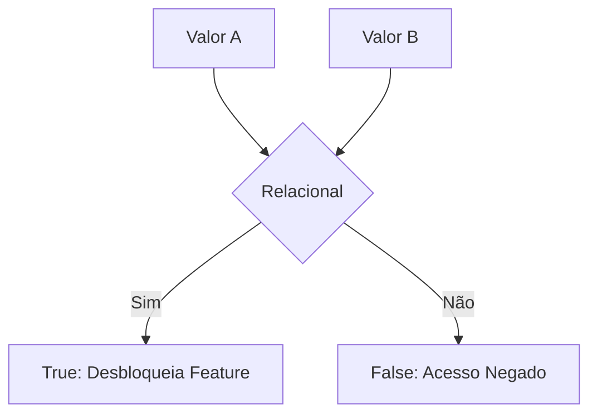

# Domine a Lógica do Jogo: Operadores em Engenharia de Software

## 📋 Metadados
- **Título:** Operadores Aritméticos, Relacionais e Lógicos
- **Data:** 24 de Maio de 2024
- **Tags:** #EngenhariaDeSoftware #Fullstack #LogicaDeProgramacao #Gamificacao #CleanCode

---

## 🎯 Resumo Executivo
No desenvolvimento Fullstack, os operadores são os "motores de regras" de qualquer aplicação. Eles não servem apenas para cálculos matemáticos; são as ferramentas que definem o fluxo do usuário (UX), a segurança de acesso e a persistência de dados. Nesta lição, abordaremos como transformar comparações simples em decisões complexas de sistema, utilizando a semântica correta para evitar bugs silenciosos e garantir a performance.

---

## 📚 Conteúdo Detalhado

### 1. Operadores Aritméticos: A Economia do Sistema
São usados para manipular valores numéricos. Em gamificação, imagine que cada ação do usuário gera **XP (Experiência)**.

| Operador | Nome | Exemplo (JS/TS) | Contexto Real |
| :--- | :--- | :--- | :--- |
| `+` | Adição | `totalXP + bonus` | Carrinho de compras |
| `-` | Subtração | `vida - dano` | Estoque de produtos |
| `*` | Multiplicação | `preco * qtd` | Cálculo de impostos |
| `/` | Divisão | `total / parcelas` | Rateio de custos |
| `%` | Módulo (Resto) | `id % 2 === 0` | Alternância de cores em tabelas (Zebra) |
| `**` | Exponenciação| `2 ** 3` | Cálculos de juros compostos |

### 2. Operadores Relacionais: Os Portões de Acesso (Checkpoints)
Determinam a relação entre dois valores, retornando sempre um Booleano (`true` ou `false`).



*   `==` vs `===`: No Fullstack moderno (especialmente JS/TS), use sempre a **Igualdade Estrita (`===`)** para comparar valor e tipo, evitando coerções inesperadas.
*   `!=` vs `!==`: Desigualdade estrita.
*   `>`, `<`, `>=`, `<=`: Essenciais para paginação e filtros de preço.

### 3. Operadores Lógicos: A Árvore de Decisão Avançada
Permitem combinar múltiplas condições.

*   **AND (`&&`)**: Todas as condições devem ser verdadeiras. (Ex: Usuário logado **E** tem assinatura ativa).
*   **OR (`||`)**: Pelo menos uma deve ser verdadeira. (Ex: Usuário é Admin **OU** é o dono do post).
*   **NOT (`!`)**: Inverte o estado logico. (Ex: **NÃO** está carregando).

---

## 💡 Insights e Conexões

1.  **Short-circuit Evaluation (Avaliação Curto-Circuito):** Em JS, o operador `&&` para na primeira condição falsa. Isso é usado para renderização condicional no React: `{user && <Dashboard />}`.
2.  **Operador Nullish Coalescing (`??`):** Uma evolução importante para desenvolvedores Fullstack. Ele retorna o lado direito apenas se o esquerdo for `null` ou `undefined`, poupando bugs onde o valor `0` (zero) seria tratado como falso pelo `||`.
3.  **Clean Code:** Evite "Negativas Duplas" (ex: `!isNotValid`). Prefira `isValid`. Facilita a leitura cognitiva do código.

---

## ✅ Checklist
- [ ] Sei a diferença entre `==` e `===` e por que o segundo é preferível.
- [ ] Consigo usar o operador `%` para identificar números pares ou criar ciclos.
- [ ] Entendo como os operadores lógicos controlam o fluxo de renderização no Front-end e validação no Back-end.

---

```json
[
  {
    "question": "No desenvolvimento JavaScript/TypeScript, qual o resultado da expressão (0 == false) e (0 === false), respectivamente?",
    "options": [
      "false e false",
      "true e true",
      "true e false",
      "false e true"
    ],
    "answer": 2
  },
  {
    "question": "Um desenvolvedor precisa garantir que uma funcionalidade seja exibida apenas se o usuário tiver um 'cupom válido' OU se ele for um 'membro VIP'. Qual operador lógico deve ser usado?",
    "options": [
      "&& (AND)",
      "|| (OR)",
      "! (NOT)",
      "?? (Nullish)"
    ],
    "answer": 1
  },
  {
    "question": "Qual é a principal utilidade do operador de Módulo (%) em uma lógica de interface de usuário (UI)?",
    "options": [
      "Calcular a porcentagem de desconto de um produto.",
      "Dividir o layout em colunas de forma arredondada.",
      "Identificar padrões cíclicos, como alternar cores de linhas em uma tabela.",
      "Verificar se um valor é nulo ou indefinido."
    ],
    "answer": 2
  }
]
```