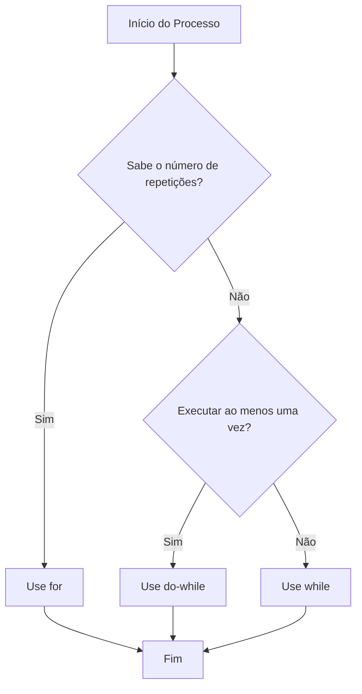

# Estruturas de Repetição: O Loop Infinito do Sucesso

## 📋 Metadados
- **Título:** Loop Theory: Dominando for, while e do-while em Aplicações Fullstack.
- **Data:** 24 de Maio de 2024.
- **Tags:** #SoftwareEngineering #Fullstack #ControlFlow #Algorithms #Gamification.

## 🎯 Resumo Executivo
Estruturas de repetição (loops) permitem a execução de um bloco de código múltiplas vezes com base em uma condição. No desenvolvimento Fullstack, eles são vitais para renderizar listas no Front-end (React/Vue) ou processar filas de dados e registros de banco de dados no Back-end (Node.js/Python/Java). O segredo da maestria é saber qual "arma" escolher para cada cenário: controle total (`for`), incerteza baseada em condição (`while`) ou execução garantida (`do-while`).

## 📚 Conteúdo Detalhado

### 1. O Loop `for` (A Jornada Planejada)
É utilizado quando sabemos exatamente quantas iterações são necessárias. É o padrão ouro para percorrer Arrays.
*   **Analogia Gamer:** Uma fase com 10 inimigos fixos que você precisa derrotar para avançar.

### 2. O Loop `while` (A Missão de Sobrevivência)
Executa enquanto uma condição for verdadeira. Se a condição for falsa desde o início, o bloco nunca é executado.
*   **Analogia Gamer:** "Enquanto o HP do Boss > 0, continue atacando".

### 3. O Loop `do-while` (O Tutorial Obrigatório)
Garante que o código seja executado **pelo menos uma vez** antes de testar a condição.
*   **Analogia Gamer:** O jogador precisa pressionar "Start" pelo menos uma vez para verificar se o jogo começa ou fecha.

### Fluxograma de Decisão Logica


### Exemplos Práticos (Sintaxe Universal)

```javascript
// FOR: Renderizando itens de um carrinho
const produtos = ['Espada', 'Escudo', 'Poção'];
for (let i = 0; i < produtos.length; i++) {
    console.log(`Item ${i+1}: ${produtos[i]}`);
}

// WHILE: Aguardando resposta de uma API/Socket
let conectado = false;
while (!conectado) {
    conectado = checarStatusConexao(); // Pode rodar 0 ou N vezes
}

// DO-WHILE: Menu de interação
let opcao;
do {
    opcao = exibirMenuERetornarSelecao();
} while (opcao !== 'SAIR');
```

## 💡 Insights e Conexões
*   **Performance:** Loops aninhados (um `for` dentro de outro) resultam em complexidade quadrática $O(n^2)$. Em grandes volumes de dados no Back-end, isso pode derrubar sua API.
*   **Imutabilidade:** No ecossistema Modern Fullstack (React/Next.js), evitamos loops manuais em favor de métodos funcionais como `.map()`, `.filter()` e `.reduce()`, que utilizam o `for` "sob o capô" de forma mais segura.
*   **O Erro Fatal:** O loop infinito. Sempre garanta que sua **condição de parada** seja alcançável, ou você consumirá toda a memória do cliente ou do servidor.

## ✅ Checklist
- [ ] Compreendi a diferença entre iteração definida e indefinida.
- [ ] Sei identificar o risco de um loop infinito.
- [ ] Entendo que `do-while` sempre executa o bloco de código uma vez.
- [ ] Consigo transpor esses conceitos para métodos de Array (map/forEach).