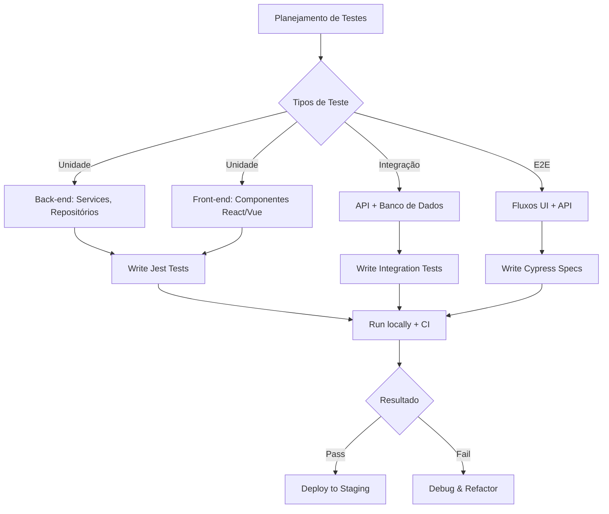

# Teste de Software: Do Conceito à Automação  

## 📋 Metadados  
- **Título:** Teste de Software – Conceitos, Estratégias e Automação  
- **Data:** 2024-10-31  
- **Tags:** #Teste #EngenhariaDeSoftware #Qualidade #Automação #Fullstack  

## 🎯 Resumo Executivo  
Nesta lição, você aprenderá os fundamentos dos testes de software, desde a classificação dos tipos de teste até a implementação de pipelines de CI/CD com automação. O objetivo é capacitar desenvolvedores Fullstack a planejar, escrever e integrar testes de unidade, integração e end‑to‑end, garantindo qualidade e agilidade nas entregas.  

## 📚 Conteúdo Detalhado  

### 1. Por que testar?  
- **Mitigar riscos:** detectar defeitos antes que cheguem à produção.  
- **Facilitar refatoração:** testes servem como “contrato” que protege funcionalidades existentes.  
- **Acelerar entregas:** pipelines automatizados permitem releases contínuos com confiança.  

### 2. Classificação dos Testes  
| Tipo de Teste | Escopo | Quando usar | Ferramentas típicas |
|---------------|--------|-------------|---------------------|
| **Unidade** | Função ou método isolado | Durante o desenvolvimento | Jest, Mocha, JUnit |
| **Integração** | Interação entre módulos | Pós‑implementação de funcionalidades | Supertest, Testcontainers |
| **End‑to‑End (E2E)** | Fluxo completo da aplicação | Antes da liberação ao usuário | Cypress, Playwright |
| **Contratual** | API contract (OpenAPI/GraphQL) | Integrações externas | Pact, Dredd |
| **Performance / Load** | Comportamento sob carga | Validação de escalabilidade | k6, JMeter |
| **Segurança** | Vulnerabilidades e ataques | Análises de risco | OWASP ZAP, Snyk |  

### 3. Estratégia de Testes para Aplicações Fullstack  



### 4. Implementando Testes Automatizados  
1. **Configuração do ambiente**  
   - Node ≥ 18, Docker (para bancos de teste).  
   - Arquivo `jest.config.js` com `coverageThreshold`.  
2. **Escrevendo testes de unidade**  
   ```js
   // exemplo com Jest
   import { soma } from './calculadora';
   test('soma dois números positivos', () => {
     expect(soma(2, 3)).toBe(5);
   });
   ```  
3. **Testes de integração com containers**  
   - Use `testcontainers` para subir um PostgreSQL temporário.  
4. **E2E com Cypress**  
   ```js
   // cypress/integration/login.spec.js
   describe('Login Flow', () => {
     it('deve autenticar usuário válido', () => {
       cy.visit('/login');
       cy.get('#email').type('user@example.com');
       cy.get('#password').type('senha123');
       cy.get('button[type=submit]').click();
       cy.url().should('include', '/dashboard');
     });
   });
   ```  
5. **Integração no CI/CD**  
   - GitHub Actions / GitLab CI: stage `test` → `npm ci && npm test && npx cypress run`.  
   - Fail fast: pipeline bloqueia merge se cobertura < 80%.  

### 5. Métricas de Qualidade  
- **Cobertura de código** (linha, branch, função).  
- **Tempo médio de execução** dos testes (ideal < 5 min em CI).  
- **Taxa de falhas** (flaky tests → usar retries ou revisar).  
- **Defeitos pós‑release** (DDD – Defect Detection Rate).  

## 💡 Insights e Conexões  
- **Test‑Driven Development (TDD):** escrever o teste antes do código pode reduzir bugs em até 40 % e melhorar a legibilidade.  
- **Shift‑Left Testing:** deslocar testes para as fases iniciais acelera feedback e diminui custo de correção.  
- **Observabilidade:** logs e traces gerados durante testes automatizados ajudam a identificar gargalos de performance.  
- **Gamificação:** recompense desenvolvedores que mantêm cobertura > 90 % ou reduzem o tempo de build usando badges no repositório.  

## ✅ Checklist  

- [ ] Definir critérios de aceitação para cada user story.  
- [ ] Configurar Jest e Cypress no projeto.  
- [ ] Implementar pelo menos um teste de unidade por função/método crítico.  
- [ ] Criar testes de integração para rotas API que acessam o banco.  
- [ ] Escrever E2E para fluxos de usuário de ponta a ponta (login, checkout, etc.).  
- [ ] Configurar pipeline CI que execute todos os testes e bloqueie merge em falha.  
- [ ] Monitorar cobertura e definir metas (ex.: > 80 % de cobertura total).  
- [ ] Revisar testes flaky a cada sprint e aplicar correções.  
- [ ] Documentar estratégia de testes no README do repositório.  

---

```json
[
  {
    "question": "Qual é a principal vantagem de adotar o TDD (Test‑Driven Development) em um projeto Fullstack?",
    "options": [
      "Reduzir o tempo de desenvolvimento em 50 %",
      "Garantir 100 % de cobertura de código automaticamente",
      "Forçar a escrita de testes antes do código, melhorando a qualidade e a documentação",
      "Eliminar a necessidade de testes de integração"
    ],
    "answer": 2
  },
  {
    "question": "Em um pipeline CI/CD, qual estágio costuma ser responsável por executar testes de performance (load)?",
    "options": [
      "Build",
      "Test",
      "Deploy",
      "Release"
    ],
    "answer": 1
  },
  {
    "question": "Qual ferramenta abaixo é mais indicada para testes de contrato de APIs RESTful?",
    "options": [
      "Cypress",
      "Jest",
      "Pact",
      "Selenium"
    ],
    "answer": 2
  }
]
```