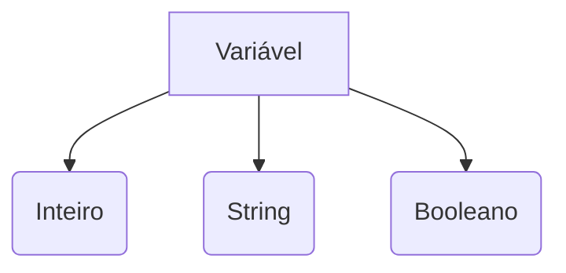

# Variáveis e Tipos de Dados
## 📋 Metadados
- **Título:** Variáveis e Tipos de Dados
- **Data:** 08/05/2026
- **Tags:** #estudo #python #fundamentos

## 🎯 Resumo Executivo
Nesta lição, exploramos como o Python lida com a memória através de variáveis e seus tipos dinâmicos.

## 📚 Conteúdo Detalhado
Python é uma linguagem de tipagem dinâmica e forte. Isso significa que você não precisa declarar o tipo, mas o Python garante que as operações sejam válidas para o tipo.

### Exemplo Mermaid


## 💡 Insights e Conexões
- **Por que importa:** Gerenciamento eficiente de dados.
- **Conexões:** Essencial para entender estruturas de dados mais complexas.

## ✅ Checklist
- [ ] Entendi a diferença entre int e float?
- [ ] Sei o que é tipagem dinâmica?

```json
[
  {
    "question": "Qual é a característica da tipagem no Python?",
    "options": ["Dinâmica e Fraca", "Estática e Forte", "Dinâmica e Forte", "Estática e Fraca"],
    "answer": 2
  },
  {
    "question": "Qual comando é usado para descobrir o tipo de uma variável?",
    "options": ["typeof()", "kind()", "type()", "class()"],
    "answer": 2
  },
  {
    "question": "Como declarar uma constante em Python (por convenção)?",
    "options": ["const X = 1", "LET X = 1", "X = 1", "X_CONST = 1 (Tudo em maiúsculo)"],
    "answer": 3
  }
]
```
