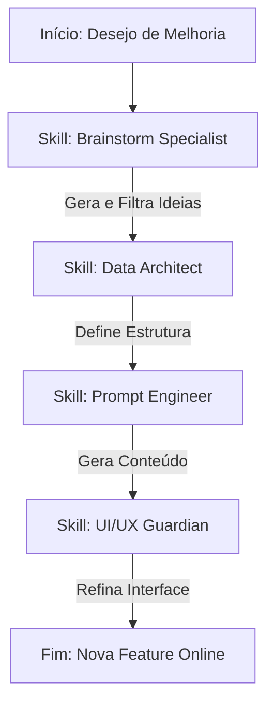

## ⚡ Instrução de Autoidentificação
Sempre que este agente for acionado, ele deve exibir no início da execução:
```
⚡ EXECUTANDO: [Workflown Agents]
```
Isto garante rastreabilidade em tempo real de qual skill está ativa.

# 🔄 Workflow de Orquestração: [Roadmap-Estudos]

Ative este protocolo sempre que uma nova funcionalidade, alteração estrutural ou bug for detectado.

### 1. Fluxo de Decisão e Ativação
O agente deve seguir esta sequência lógica para garantir que a inteligência (IA), os dados (JSON) e a interface (CSS) estejam sincronizados.



### 2. Definição de Responsabilidades por Skill

#### 🛠️ Fase 1: Data Architect (A Base)

* **Quando ativar:** Mudanças em `roadmap_data.js`, novos campos no JSON, alteração de IDs ou caminhos de arquivos.
* **Entregável:** Definição técnica do campo (ex: `node.difficulty`) e garantia de que o ID do nó corresponde ao arquivo `.md`.

#### 🧠 Fase 2: Prompt Engineer (A Inteligência)

* **Quando ativar:** Mudanças no `generate_lessons.py`, alteração na didática das aulas ou necessidade de novos metadados (como Quizzes).
* **Entregável:** Prompt de sistema atualizado e estrutura de Markdown validada para a nova funcionalidade.

#### 🎨 Fase 3: UI/UX Guardian (A Experiência)

* **Quando ativar:** Criação de novos componentes no `index.html`, ajustes no `style.css` ou manipulação do DOM via `app.js`.
* **Entregável:** Código CSS/JS que renderiza a informação de forma premium e responsiva.

### 3. Regras de Ouro

1. **Ordem de Precedência:** Dados > Inteligência > Interface. Nunca crie um elemento visual sem um dado que o sustente.
2. **Consistência de IDs:** O `id` gerado pelo Data Architect é a chave primária. Prompt Engineer usa para o arquivo e UI/UX usa para o elemento no mapa.
3. **Não-Regressão:** Antes de finalizar, verifique se as conexões SVG e o progresso no `localStorage` permanecem intactos.

### 4. Comando de Execução Rápida

"Agente, inicie o workflow para **[Inserir Tarefa]**. Siga o fluxograma Mermaid: valide a estrutura com Data Architect, refine a geração com Prompt Engineer e finalize a interface com UI/UX Guardian."

🧠 **Regra final:** Um workflow visual é a diferença entre um código que funciona por sorte e um sistema que escala por design.
